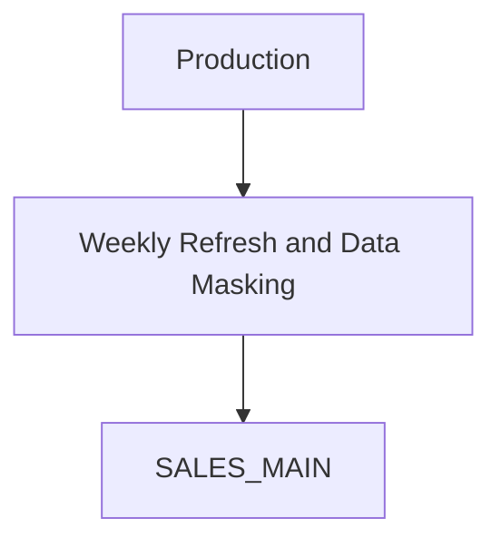
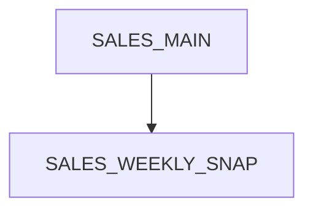
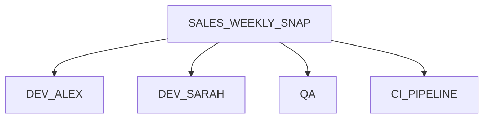
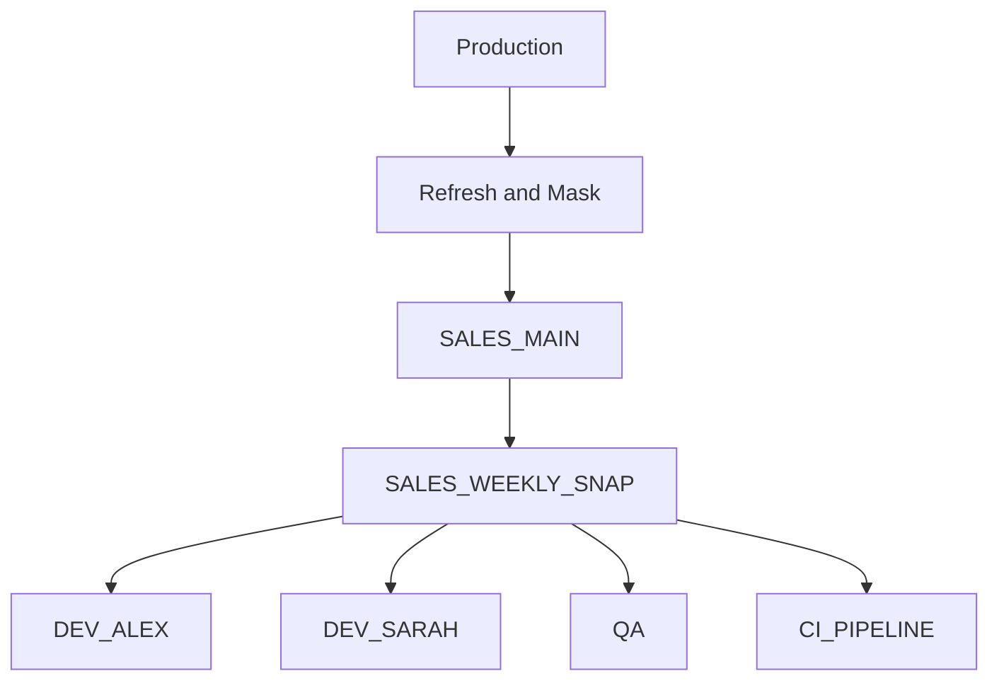

# Exadata Exascale Labs Reference Architecture

This document describes the reference architecture used throughout the Exadata Exascale Labs.

Each lab builds on a common environment, introducing additional snapshot and cloning capabilities while preserving the same core objects, naming conventions, and workflows.

## Reference Architecture

The labs begin with a development PDB that has already been refreshed from production.

As part of the refresh process, sensitive data is masked to satisfy security and privacy requirements.

This refreshed PDB becomes the authoritative source for all subsequent snapshot and clone operations.

<!-- Figure 1: Reference Architecture -->

`SALES_MAIN` represents the main development database for the current refresh cycle.

Application teams do not connect directly to `SALES_MAIN`. Instead, it serves as the source for snapshots and thin clones, preserving a consistent starting point for development and testing.

## Snapshot Workflow

Snapshots capture the state of `SALES_MAIN` at a point in time.

Each snapshot provides a stable foundation for creating one or more independent development and test environments.

<!-- Figure 2: Snapshot Workflow -->

For simplicity, the early labs use a single snapshot.

Later labs introduce snapshot carousels, automated retention, and multiple snapshots.

## Thin Clone Workflow

Thin clones are provisioned from the snapshot.

Each clone is a fully independent read-write PDB while initially sharing unchanged storage with the source snapshot.

<!-- Figure 3: Thin Clone Workflow -->

As applications modify data, only changed blocks consume additional storage.

This enables many independent development and test environments to be provisioned quickly while minimizing storage consumption.

## Repository Progression

The repository has been designed as a progressive workshop.

Each lab uses the common setup environment and introduces an additional snapshot or cloning workflow.

| Lab | Topic |
|------|-------|
| Lab 01 | PDB Thin Clones |
| Lab 02 | PDB Snapshot Carousels |
| Lab 03 | Cross-CDB PDB Cloning |

## Object Lifecycle

The following diagram illustrates how objects are created during the workshop.

<!-- Figure 4: Object Lifecycle -->

The setup scripts create `SALES_MAIN`.

Each lab creates only the additional objects required for that exercise.

Cleanup scripts remove those temporary objects and return the environment to a known state.

## Naming Conventions

| Object | Name |
|---------|------|
| Main development PDB | `SALES_MAIN` |
| Weekly snapshot | `SALES_WEEKLY_SNAP` |
| Developer clone | `DEV_ALEX` |
| Developer clone | `DEV_SARAH` |
| QA environment | `QA` |
| CI environment | `CI_PIPELINE` |

## Repository Structure

| Directory | Purpose |
|-----------|---------|
| `docs/` | Reference documentation |
| `setup/` | Creates the common starting environment |
| `common/` | Shared helper and verification scripts |
| `lab-*` | Hands-on walkthroughs |

Each lab includes its own README describing the objectives, prerequisites, execution steps, expected results, and cleanup.

## Design Principles

- Oracle RAC is assumed throughout.
- Oracle Managed Files (OMF) are assumed.
- Commands are executed from `CDB$ROOT` unless stated otherwise.
- `GV$` views are preferred over `V$` where instance awareness is required.
- `INSTANCES=ALL` is used for operations that affect PDB state across the cluster.
- Every significant operation is followed by a verification step.
- Reusable verification queries are maintained in the `common` directory.

## Diagram Format

Use Mermaid diagrams for architecture and workflow visuals in this repository. Keep diagrams in the Markdown source so they remain reviewable and evolve with the labs.

SVG artwork stored under `docs/images/` may supplement Mermaid diagrams where a presentation-quality illustration is needed.
