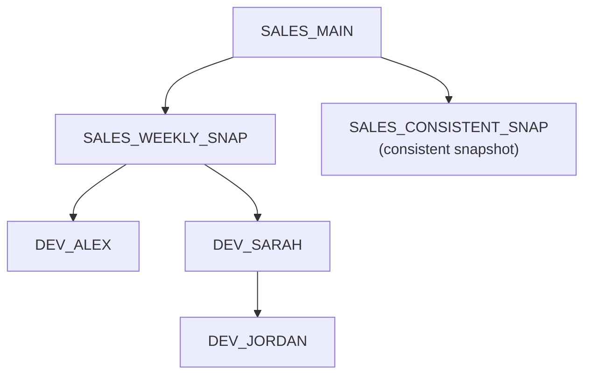

# Lab 01: PDB Thin Clones

This lab demonstrates how to provision thin development PDBs from a stable weekly source on Exadata Exascale.

The workflow follows the repository reference architecture:



`SALES_MAIN` is the masked development source created by the setup scripts. `SALES_WEEKLY_SNAP` is a named PDB snapshot used as the reusable clone source. `DEV_ALEX` and `DEV_SARAH` are independent read-write thin clones.
`SALES_CONSISTENT_SNAP` is a `CONSISTENT` snapshot. The later clone steps use `SALES_WEEKLY_SNAP`.
`DEV_JORDAN` is a thin clone created from `DEV_SARAH` to demonstrate a hierarchical clone workflow.

## Prerequisites

- Oracle AI Database 26ai
- Exadata Exascale
- Exadata System Software 24.1 or later
- Oracle RAC with two or more instances
- Oracle Managed Files enabled
- SQLcl or SQL*Plus
- SYSDBA or equivalent privileges
- `SALES_MAIN` exists and is open
- Passwordless SSH equivalence from the central database server to the database servers as `root`, and to the storage servers as `celladmin` (the default) or `root`. This is required by `../setup/03-verify-exadata-software.sh`.

Run setup first if required:

```bash
../setup/03-verify-exadata-software.sh \
  --dbs-nodes dbnode01,dbnode02 \
  --cells-nodes cell01,cell02,cell03
```

To use `root` for the storage-server checks instead of the default `celladmin`, add `--cells-user root`.

```sql
@../setup/00-create-sales-main.sql
@../setup/01-mask-data.sql
@../setup/02-verify-environment.sql
```

## Scripts

| File | Purpose |
|------|---------|
| `00-run-lab.sh` | Runs Lab 01 end-to-end without pauses and leaves the resulting state available for inspection |
| `01-create-snapshot.sql` | Creates the explicit `SALES_WEEKLY_SNAP` PDB snapshot from `SALES_MAIN` |
| `02-create-consistent-snapshot.sql` | Creates `SALES_CONSISTENT_SNAP` with the `CONSISTENT` snapshot variation |
| `03-create-clones.sql` | Creates snapshot-copy clones `DEV_ALEX` and `DEV_SARAH` from `SALES_MAIN` using `SALES_WEEKLY_SNAP` |
| `04-verify-independence.sql` | Writes clone-local marker rows and verifies clone independence |
| `05-create-clone-of-clone.sql` | Creates `DEV_JORDAN` as a snapshot-copy clone of `DEV_SARAH`, then drops `DEV_SARAH` to prove independence |
| `06-refresh-clone.sql` | Refreshes `DEV_ALEX` by dropping and recreating it from `SALES_WEEKLY_SNAP`, then verifies that clone-local marker data was reset |
| `07-cleanup.sql` | Drops the lab clones and named PDB snapshots |

## Run-Through

To prepare the completed Lab 01 state for inspection, run:

```bash
./00-run-lab.sh
```

The runner uses SQLcl when available and SQL*Plus as the fallback. Set `LAB_DB_CONNECT` to override the default `/ as sysdba` connection string.
It validates that `SALES_MAIN` exists before cleanup or lab execution.

## Walkthrough

Create the stable weekly snapshot:

```sql
@01-create-snapshot.sql
```

Create a consistent snapshot variation for comparison:

```sql
@02-create-consistent-snapshot.sql
```

Create the developer clones:

```sql
@03-create-clones.sql
```

Verify that the clones are independent:

```sql
@04-verify-independence.sql
```

Create a hierarchical clone from one developer clone, then drop the source clone:

```sql
@05-create-clone-of-clone.sql
```

Refresh one clone from the weekly snapshot:

```sql
@06-refresh-clone.sql
```

The refresh verification reports `PASS` when the clone-local marker table is
absent, or when the prior `DEV_ALEX` marker row is absent if that table is part
of the snapshot baseline.

Clean up the lab:

```sql
@07-cleanup.sql
```

Cleanup runs without interactive pauses.

## Consistent Snapshots

By default, a PDB snapshot captures the point in time quickly. Any required redo
application is deferred until a clone is created from that snapshot, so the redo
must remain available. A snapshot created with `CONSISTENT` applies that redo
during snapshot creation instead. This takes longer initially, but allows later
clones to be created without the same redo-application work and without retaining
the original redo, which makes it well suited to long-lived, ready-to-clone
baselines.

`SALES_CONSISTENT_SNAP` in this lab uses this option. The later clone steps
continue to use `SALES_WEEKLY_SNAP`.

For a detailed explanation, see [Exascale Snapshots and Clones: Core Concepts](https://blogs.oracle.com/exadata/exascale-snapshots-and-clones-core-concepts).

## Notes

- The lab creates an explicit PDB snapshot with `ALTER PLUGGABLE DATABASE SNAPSHOT`.
- The lab also creates a consistent snapshot with `ALTER PLUGGABLE DATABASE SNAPSHOT ... CONSISTENT`.
- Clones are created as thin clones from the reusable snapshot with `CREATE PLUGGABLE DATABASE ... USING SNAPSHOT ... SNAPSHOT COPY`.
- A clone can also be used as the source for another thin clone with `CREATE PLUGGABLE DATABASE ... FROM source_clone SNAPSHOT COPY`.
- Clone PDBs are opened with `INSTANCES = ALL` for RAC.
- Oracle Managed Files is assumed, so no `FILE_NAME_CONVERT` clause is used.
- Project-level follow-up items are tracked in `../docs/todo.md`.

## References

- Oracle AI Database SQL Language Reference: `CREATE PLUGGABLE DATABASE`
- Oracle AI Database Administrator's Guide: Cloning a PDB
