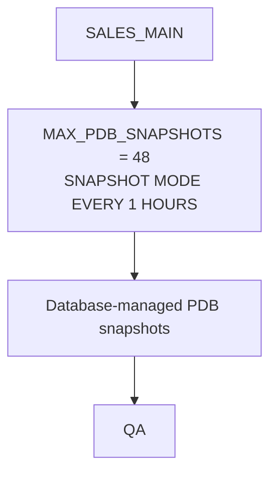

# Lab 02: PDB Snapshot Carousels

This lab demonstrates how to enable the database-managed PDB snapshot carousel
for `SALES_MAIN`, capture an optional precise post-refresh snapshot, and
provision a QA thin clone from the newest available snapshot.

The workflow uses the common `SALES_MAIN` source PDB created by setup:



`SALES_MAIN` is the masked development source created by the setup scripts.
The database manages the snapshot cadence after `SNAPSHOT MODE EVERY` is
enabled. `QA` is an optional read-write snapshot-copy clone created from the
newest snapshot once the carousel has produced one.

## Prerequisites

- Oracle AI Database 26ai
- Exadata Exascale
- Exadata System Software 24.1 or later
- Oracle RAC with two or more instances
- Oracle Managed Files enabled
- SQLcl or SQL*Plus
- SYSDBA or equivalent privileges
- `SALES_MAIN` exists and is open
- `CDB_UNIQUE_NAME` is exported for the shell session or set in `../common/config.sql`, and the PDB service account can run `srvctl`

Run setup first if required:

```sql
@../setup/00-create-sales-main.sql
@../setup/01-mask-data.sql
@../setup/02-verify-environment.sql
```

Lab 01 does not need to be left in place, but the common setup PDB must exist.

## Scripts

| File | Purpose |
|------|---------|
| `00-run-lab.sh` | Verifies Oracle connectivity, enables the automated carousel without pauses, and leaves it enabled for inspection |
| `01-enable-snapshot-carousel.sql` | Sets `MAX_PDB_SNAPSHOTS = 48` and enables `SNAPSHOT MODE EVERY 1 HOURS` for `SALES_MAIN` |
| `02-verify-snapshot-carousel.sql` | Reports carousel mode, interval, maximum snapshots, and current snapshot metadata |
| `03-capture-post-refresh-snapshot.sql` | Captures a manually named, precise point after an in-place `SALES_MAIN` refresh |
| `03-create-qa-from-latest-snapshot.sql` | Creates `QA` from the newest available snapshot after one exists |
| `03-verify-qa.sql` | Verifies QA availability and service placement after Clusterware starts it |
| `04-cleanup.sql` | Drops `QA` and the named post-refresh snapshot, disables the automated carousel, and reports remaining interval snapshots |

## Run-Through

To enable and verify the automated carousel, run:

```bash
./00-run-lab.sh
```

The runner uses Oracle SQLcl when available and SQL*Plus as the fallback. Set
`LAB_DB_CONNECT` to override the default `/ as sysdba` connection string. It
first reports the connected CDB, container, and database version, then validates
that `SALES_MAIN` exists before cleanup or lab execution. It does not run
`03-create-qa-from-latest-snapshot.sql` because the database may not create the
first interval snapshot immediately. It uses
`../common/manage-pdb-clusterware.sh` for PDB resources and services.

## Walkthrough

Enable the automated snapshot carousel:

```sql
@01-enable-snapshot-carousel.sql
```

Verify carousel mode and snapshot metadata:

```sql
@02-verify-snapshot-carousel.sql
```

After the database has created a carousel snapshot, first remove any prior QA
clone from Clusterware management. This stops its PDB service, closes the PDB
through its Clusterware resource, and removes both resources so the SQL can
safely drop and recreate `QA`. The command is idempotent: it reports and skips
resources that are already absent.

```bash
../common/manage-pdb-clusterware.sh stop-and-remove QA
```

Create the QA clone from the newest snapshot:

```sql
@03-create-qa-from-latest-snapshot.sql
```

Create and start its Clusterware PDB resource and service:

```bash
../common/manage-pdb-clusterware.sh ensure-and-start QA
```

Verify QA availability, service placement, and snapshot state:

```sql
@03-verify-qa.sql
```

If the source must be captured immediately after an in-place refresh, rather
than at the next carousel interval, use a separate manual snapshot:

```sql
@03-capture-post-refresh-snapshot.sql
```

Clean up the lab:

```sql
@04-cleanup.sql
```

Before cleanup, run `../common/manage-pdb-clusterware.sh stop-and-remove QA`.

Cleanup runs without interactive pauses. It drops the named precise
post-refresh snapshot, disables the automated carousel, and does not drop
database-managed interval snapshots that already exist.

## Notes

- The lab sets `MAX_PDB_SNAPSHOTS = 48` before enabling the carousel.
- The carousel uses `ALTER PLUGGABLE DATABASE SNAPSHOT MODE EVERY 1 HOURS`.
- The database creates and manages carousel snapshots after snapshot mode is
  enabled.
- An interval snapshot is scheduled independently of any refresh. It is not a
  post-refresh trigger. Use `03-capture-post-refresh-snapshot.sql` when an
  exact post-refresh point is required.
- Refresh `SALES_MAIN` in place. Do not drop and recreate it, because that
  discards the PDB and its carousel history.
- Disabling snapshot mode stops future automated snapshots. Existing
  database-managed snapshots remain visible in `DBA_PDB_SNAPSHOTS`.
- `QA` is created from the newest snapshot reported by `DBA_PDB_SNAPSHOTS`.
  That snapshot can be interval-created or the named precise post-refresh
  snapshot. `DBA_PDB_SNAPSHOTS` reports snapshot metadata but does not label a
  row by creation trigger, so keep the precise snapshot name distinct.
- `QA` is created as a thin clone with
  `CREATE PLUGGABLE DATABASE ... USING SNAPSHOT ... SNAPSHOT COPY`.
- Clusterware PDB resources and PDB services control clone availability and RAC placement.
- Oracle Managed Files is assumed, so no `FILE_NAME_CONVERT` clause is used.
- Project-level follow-up items are tracked in `../docs/todo.md`.
