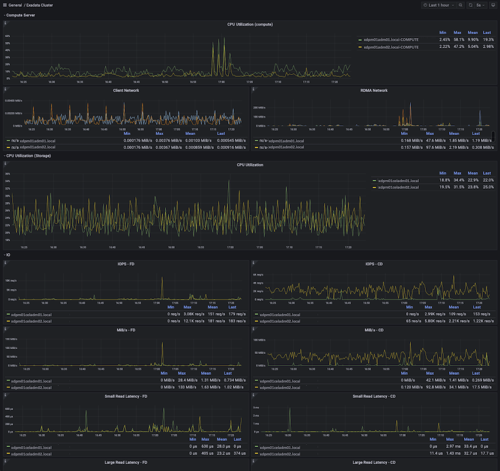

#Oracle Exadata Real-Time Insight

## Prometheus and Grafana Requirements

For the dashboards in this folder to work correctly, the following applications are required:

- Grafana (minimum version 10.0.2), which includes the Prometheus plugin for Grafana.
- Prometheus (minimum version 2.45.0)
- Oracle Exadata System Software 22.1.0+. Follow the instructions for [Using Real-Time Insight](https://www.oracle.com/pls/topic/lookup?ctx=en/engineered-systems/exadata-database-machine&id=SAGUG-GUID-8448C324-784E-44F5-9D44-9CB5C697E436) in the *Oracle Exadata System Software User's Guide* to configure the metric collection and upload parameters.

## Example Grafana Dashboard

## Grafana Dashboards for Exadata Monitoring

The Grafana dashboards use Exadata metrics that are enabled for Real-Time Insight. The examples use Prometheus Query Language (PromQL) against a Prometheus data source that pulls the Exadata metrics.

**Note:** These dashboards are examples and are not fully supported.

The following dashboards are included:

- Exadata Cluster: Provides a cluster-wide view that shows metrics for compute nodes and storage servers. You can use this to navigate to the other dashboards.
- Compute: Provides a compute-node view that shows CPU and network utilization for the compute nodes.
- Storage Server: Provides a storage-server-centric view that focuses on storage server CPU and I/O metrics, as well as Exadata metrics for Smart Flash Cache, Smart Flash Log, and Smart I/O.
- Cell Disk: Shows cell disk I/O metrics on the storage server.
- Flash Cache: Shows flash cache metrics on the storage server.
- Smart Scan: Shows smart scan metrics on the storage server.
- Network: Provides a network-centric view that focuses on network throughput.

**Note:** When viewing network statistics, Oracle Linux KVM guests do not show RDMA traffic. RDMA traffic is available only on bare metal and KVM hosts.

## Navigating the Environment

The dashboards have selectors for `fleet`, `pod`, `cluster`, and `server` that enable users to navigate within the environment. To use these navigation selectors in the dashboards, you need to set `fleet`, `pod`, and `cluster` as metric tags on your servers. To configure metric tags, see [Tagging Metric Observations](https://www.oracle.com/pls/topic/lookup?ctx=en/engineered-systems/exadata-database-machine&id=SAGUG-GUID-737B58F4-3FE3-4F42-8CB5-294D6CEECFCA).

The following example shows one way to use the `fleet`, `pod`, and `cluster` selectors:

- You can use `fleet` to organize the servers based on the business unit or usage of the server. For example: DEV, TEST, PROD.
- You can use `pod` to group interconnected Exadata nodes.
  - For bare metal, this can be the compute nodes and storage servers.
  - For virtualized environments, this can include the KVM hosts, KVM guests, and storage servers.
- You can use `cluster` to define the nodes in an Oracle Real Application Clusters (Oracle RAC) cluster.

## Importing Dashboards

When you import the dashboards into your Grafana installation, you are prompted for the Prometheus data source.

In addition, when importing the Exadata Cluster dashboard, you are prompted for the links for the Compute and Storage Server dashboards in the linkComputeDetails and linkCellDetails variables. These variables should already contain the correct dashboard UIDs. However, you may need to modify the links if you changed the UIDs when importing the other dashboards or if you have a different orgId value in Grafana. You can also modify these dashboard variables after importing. For more information, see the Grafana documentation on [dashboard variables](https://grafana.com/docs/grafana/latest/variables/).

## Documentation

You can find the online documentation of Oracle Exadata at [docs.oracle.com/en/engineered-systems/exadata-database-machine/](https://docs.oracle.com/en/engineered-systems/exadata-database-machine)

## Contributing

If you're interested in contributing to the Oracle Exadata demo project:

- Start by reading the [Contributing guide](https://github.com/oracle-samples/oracle-db-examples/blob/main/CONTRIBUTING.md).

## License

See [LICENSING.md](https://github.com/oracle-samples/oracle-db-examples/blob/main/LICENSE.md) for details.
