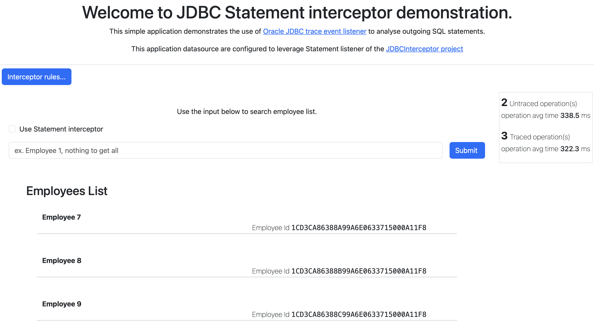
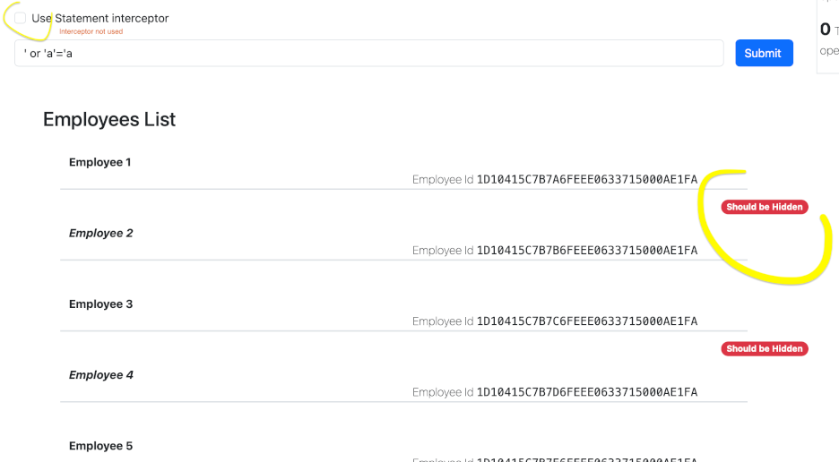
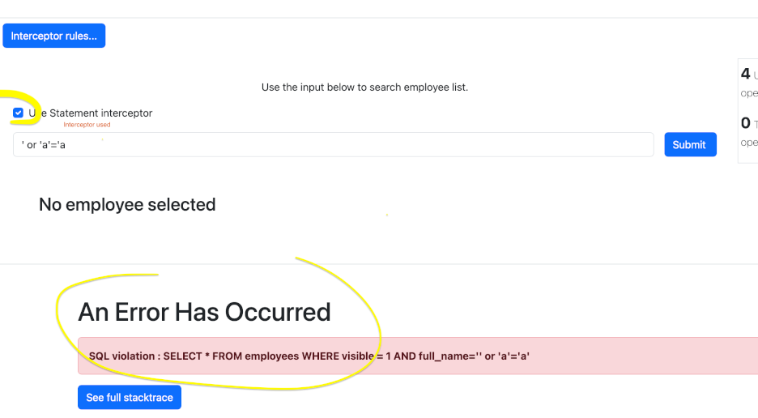
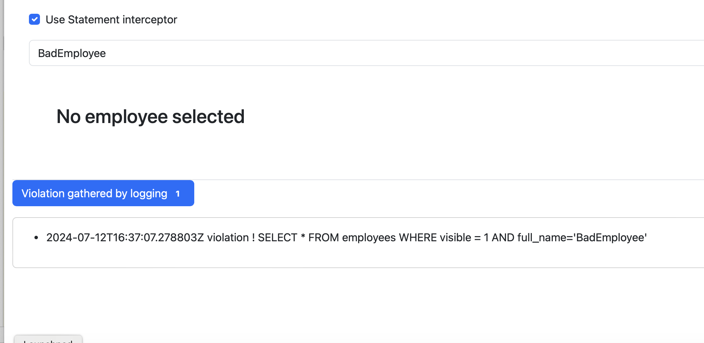

# JDBC interceptor demo application

How to transparently secure database exchanges by filtering out bad or insecure SQL statements
issued by an application ?

This simple web application fulfill that use case and demonstrates how JDBC trace event listener
can be used to analyse and may be intercept SQL statements that are sent by an application
to oracle database server. 

=================================================================================================



=================================================================================================

In this application we leverage the event listener (aka interceptor) delivered by project
https://orahub.oci.oraclecorp.com/ora-jdbc-dev/jdbc-interceptor
That is a simple standalone SpringBoot application that performs search
on an employee table. This simple table contains 5 employees like

```oracle-sql
CREATE TABLE employees (
        id CHAR(32) DEFAULT SYS_GUID() PRIMARY KEY,
        full_name VARCHAR2(60),
        visible NUMBER(1) DEFAULT 0
       )
```

Employees with 'visible' attributes set to 0 must not be seen. This flag will be 
used to demonstrate how SQL injection can lead to unexpected response.
See section [Testing the interceptor]()

The SQL statement sent to the server are intercept and analyse according the "security" rules.

## The statement interceptor

This application uses a customized UCP connection pool.
> see _com.oracle.jdbc.samples.statementinterceptordemo.TracedDataSourceConfig_


The pool configuration is taken from
> src/main/resources/oracle-pooled-ds.properties

Please change it accordingly.

Each connection delivered by this pool will have the Statement
interceptor trace event listener  attached. 

The interceptor rules are defined in 
> src/main/resources/statementRules.json

## build 

We require the following dependency

dependencies {
    implementation 'com.oracle.database.jdbc:JDBCInterceptor:0.1-SNAPSHOT'
}

## Running the application

Make sure properties are correctly set in oracle-pooled-ds.properties file 
Once the application is started, open a web browser and go to
http://localhost:8080/

### Testing the interceptor
This application host two datasources, one with an interceptor in place.
There is a checkbox that allow you to switch from one datasource to another


You can issue some search that will be intercepted by the listener

#### SQL injection example
An example is a search like 
>_' or 'a'='a_. 

When the interceptor is not enabled you will see that this search return all 
employees including the ones that are not supposed to be visible 



When the interceptor is enabled you will see the security error thrown
by the interceptor and that the request do not reach the server.



#### fixed token example

By issuing "BabEmployee" as search criteria you will see how security log record  can be intercepted.



### From intelliJ 
_Run_ > _Run statement-interceptor-demo [bootRun]_ 
### From command line
#./gradlew bootRun
