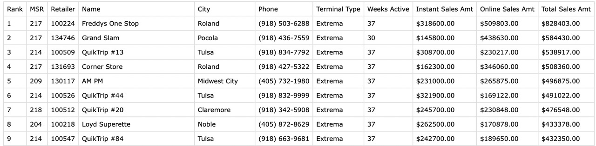
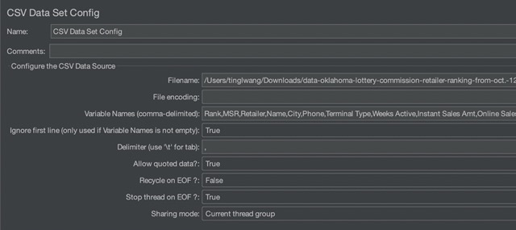
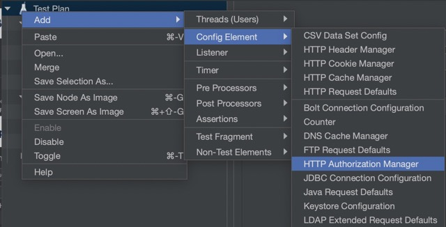

# Design High-Speed Data Ingestion Services Using MQTT, AMQP, and STOMP

In the modern workflow, large amount of records, including logs/tracing,
are sent between applications or streamed into a database. In this blog post,
we download the dataset from [Data.gov](http://www.data.gov/) as the datasource;
ActiveMQ functions as an implementation of Message Oriented Middleware (MOM) to
communicate between components, and use Reactive Streams Ingestion (RSI) to inject
the data into database in an efficient, non-blocking way.


## What is Reactive Streams Ingestion?

In 2019, we launched the Reactive Streams Ingestion library (rsi.jar) in Oracle
Database release 21c.
The library provides a service that addresses the use case of a massive volumes of
data is injected by a large number of clients, and not blocked waiting for a
synchronous response from the database.

Using RSI requires the following jars in the classpath:

* rsi.jar
* ojdbc11.jar
* ucp.jar
* ons.jar

You can get these from [Central Maven](https://repo1.maven.org/maven2/com/oracle/database/jdbc/)
or download them from the [OTN download page](https://www.oracle.com/database/technologies/appdev/jdbc-downloads.html).
This blog will create a Hello World sample in which we will send/receive MQTT, AMQP,
and STOMP messages using Apache ActiveMQ and RSI. Apache Jmeter will be used as a
handful tool to build a test plan which sends multiple HTTP requests.

## What is ActiveMQ?

ActiveMQ is a Java-based open-source message broker which supports REST API and
various wire-level protocols, such as MQTT, AMQP, STOMP. It addresses communication
requirements and integrates heterogeneous systems without any restrictions on a
specific protocol.

### Starting up ActiveMQ

ActiveMQ is available from the [Apache ActiveMQ website](https://activemq.apache.org/components/classic/download/).
Click on the link to the 5.17.2 release and you will find the tarballs and the zip
files. Once you have downloaded and expanded these, you're ready to go.

Go to the ActiveMQ directory and run the following command to start up ActiveMQ:

```shell
$ cd apache-activemq-5.17.2
$ ./bin/activemq start
INFO: Loading '/Users/tinglwang/Downloads/apache-activemq-5.17.2//bin/env'
INFO: Using java '/Library/Java/JavaVirtualMachines/jdk-11.0.5.jdk/Contents/Home/bin/java'
INFO: Starting - inspect logfiles specified in logging.properties and log4j.properties to get details
INFO: pidfile created : '/Users/tinglwang/Downloads/apache-activemq-5.17.2//data/activemq.pid' (pid '61766')
```

Now it's ready to begin handling some messages. The easiest way to begin a Hello
World application is by using the examples which come with ActiveMQ and integrate
these with RSI. The blog explains the steps to create the sample application and
streams the records into the database.

## Working with Reactive Streams Ingestion using ActiveMQ

### General Project Overview

We will use the following tools/frameworks:

* JDK 19
* ActiveMQ 5.17.2
* RSI 21.7.0.0
* Maven 3.8.1

Our project has the following directory structure:


As shown in the project structure, the sample code we use in this blog post has three
listener classes which implement the RSI logic for each protocol. The common
directory is a multi-module project which has hierarchical POM files. These POM
files already include the required dependencies.

Before we dive into the code snippets, use the following DDL script to create the table:

```sql
CREATE TABLE retailer (
    rank int,
    msr int,
    retailer varchar(255),
    name varchar(255),
    city varchar(255),
    phone varchar(255),
    terminal_type varchar(255),
    weeks_active int,
    instant_sales_amt varchar(255),
    online_sales_amt varchar(255),
    total_sales_amt varchar(255)
);
```

### Creating a JMS message consumer

#### rsi.demo.amqp.Listener

Like with any messaging-based application, you need to create a receiver that will
handle the messages that have been sent.

The code snippet below creates an AMQP connection that connects to ActiveMQ using
the given username, password, hostname, and port number. Port number 5672 is the
default port where ActiveMQ is listening over the AMQP protocol when it starts up.
It also creates a topic subscriber (i.e., consumer) to receive messages that have
been published to the "event" topic. You can find the entire codes [here](src/main/java/rsi/example/amqp/Listener.java).

```java
private static final String ACTIVEMQ_USER = "admin";
private static final String ACTIVEMQ_PASSWORD = "password";
private static final String ACTIVEMQ_HOST = "localhost";
private static final int ACTIVEMQ_PORT = 5672;
private static final String TOPIC_NAME = "event";

public static void main(String[] args) throws Exception {
  // Setup ActiveMQ connection and consumer
  String connectionURI = "amqp://" + ACTIVEMQ_HOST + ":" + ACTIVEMQ_PORT;
  JmsConnectionFactory factory = new JmsConnectionFactory(connectionURI);

  Connection connection = factory.
  createConnection(ACTIVEMQ_USER, ACTIVEMQ_PASSWORD);
  connection.start();
  Session session = connection.createSession(false, Session.AUTO_ACKNOWLEDGE);

  Destination destination = session.
  createTopic(TOPIC_NAME);

  MessageConsumer consumer = session.createConsumer(destination);
  ...
  }
```

We need to configure RSI, too. Modify DB_URL, DB_USERNAME, and DB_PASSWORD with your
database URL, user name, and password, then start the service.

In this example, we use the built-in PushPublisher. It's a simple publisher that
pushes the items received by the RSI service.

After attaching the rsi.subscriber() to the pushPublisher, RSI can start receiving
messages.

```java
private static final String DB_URL = "jdbc:oracle:thin:@your-connect-descriptor";
private static final String DB_USERNAME = "db-username";
private static final String DB_PASSWORD = "db-password";

private static final RSIService RSI_SERVICE = new RSIService();

public static void main(String[] args) throws Exception {
  RSI_SERVICE.setUrl(DB_URL);
  RSI_SERVICE.setUsername(DB_USERNAME);
  RSI_SERVICE.setPassword(DB_PASSWORD);
  RSI_SERVICE.setScheme(DB_USERNAME);
  RSI_SERVICE.setEntity(Retailer.class);
  ReactiveStreamsIngestion rsi = RSI_SERVICE.start();
  PushPublisher<Retailer> pushPublisher = ReactiveStreamsIngestion.pushPublisher();
  pushPublisher.subscribe(rsi.subscriber());
  ...
  }
```

When a message is received, the listener closes the connection if the message body
is equal to "SHUTDOWN", otherwise, it transfers the message to OracleJsonObject, and
it is consumed by the pushPublisher.

```java
while (true) {
  Message msg = consumer.receive();
  if (msg instanceof TextMessage) {
  String body = ((TextMessage) msg).getText();

  if ("SHUTDOWN".equals(body)) {
  long diff = System.currentTimeMillis() - start;
  System.out.println(String.format("Received %d in %.2f seconds", count, (1.0 * diff / 1000.0)));
  connection.close();

  // close RSI and worker threads
  pushPublisher.close();
  RSI_SERVICE.stop();

  try {
  Thread.sleep(10);
  } catch (Exception e) {
  }
  System.exit(1);

  } else {
  // Create OracleJsonObject from the incoming message
  OracleJsonObject jsonObject = JSON_FACTORY
  .createJsonTextValue(
  new ByteArrayInputStream(body.getBytes()))
  .asJsonObject();

  // Push the data
  pushPublisher.accept(new Customer(jsonObject));

  if (count == 1) {
  start = System.currentTimeMillis();
  } else if (count % 1000 == 0) {
  System.out.println(String.format("Received %d messages.", count));
  }
  count++;
  }

  } else {
  System.out.println("Unexpected message type: " + msg.getClass());
  }
  }
```

The listeners for the other protocols work in a similar way. You can find the
examples in [rsi.demo.mqtt.Listener](src/main/java/rsi/example/mqtt/Listener.java)
and [rsi.demo.stomp.Listener](src/main/java/rsi/example/stomp/Listener.java).

#### rsi.demo.common.Retailer

rsi.demo.common.Retailer class is a POJO that defines the record to be streamed.
The constructor accepts the OracleJsonObject type and converts the variable to a
plain Java object.

The @StreamedEntity annotation indicates that the class maps to a database table
named "customer"; the @StreamField annotation maps fields to the three columns of
the table: id, name and region. Note that you can always specify your own table name
and column name using the optional
[StreamEntity.tabelName()](https://docs.oracle.com/en/database/oracle/oracle-database/21/jarsi/oracle/rsi/StreamEntity.html#tableName__)
and [StreamField.columnName()](https://docs.oracle.com/en/database/oracle/oracle-database/21/jarsi/oracle/rsi/StreamField.html#columnName__)
elements.

```java
@StreamEntity(tableName = "retailer")
public static class Retailer {

  public Retailer(OracleJsonObject jsonObject) {
    Stream
      .of(this.getClass().getDeclaredFields())
      .filter(df -> (df.getAnnotation(StreamField.class) != null))
      .forEach(f -> {
        f.setAccessible(true);

        String fieldName = f.getName();
        OracleJsonValue jsonValue = jsonObject.get(fieldName);
        OracleJsonValue.OracleJsonType type = jsonValue.getOracleJsonType();

        try {
          switch (type) {
          case DECIMAL:
            f.setInt(this, jsonValue.asJsonDecimal().intValue());
            break;
          case STRING:
            f.set(this, jsonValue.asJsonString().getString());
            break;
          default:
            throw new IllegalArgumentException("unknown type");
          }
        } catch (IllegalAccessException ex) {
          ex.printStackTrace();
        }
      });
  }

  @StreamField
  public int id;

  @StreamField
  public String name;


  @StreamField
  public String region;
}
```

#### rsi.demo.common.RSIService

The class is nothing but a simple POJO that defines methods to configure, start and
stop the RSI service.

We are using the new VirtualThreadPerTaskExecutor from JDK 19, which implements the
ExecutorService interface just like the other Executors do.

In this example we use the Executors.newVirtualThreadPerTaskExecutor() to create an
ExecutorService that uses virtual threads. It will attach each task to a new virtual
thread.

```java
public final class RSIService {
  public ReactiveStreamsIngestion start() {
    if (rsi != null) {
      return rsi;
    }

    workers = Executors.newVirtualThreadPerTaskExecutor();

    rsi = ReactiveStreamsIngestion
      .builder()
      .url(url)
      .username(username)
      .password(password)
      .schema(scheme)
      .entity(entity)
      .bufferRows(1000)
      .executor(workers)
      .bufferInterval(Duration.ofMinutes(60))
      .build();

    return rsi;
  }

  public void stop() {
    if (rsi != null) {
      rsi.close();
    }

    if (workers != null) {
      workers.shutdown();
    }
  }
  ...
}
```

### Running the sample application

#### Start the listener

Run the following command to start the listener. Note: change the target class to
rsi.demo.mqtt.Listener and rsi.demo.stomp.Listener if you want to use the MQTT or
STOMP protocol.

The "--enable-preview" argument is required since Virtual Thread is a preview feature
in JDK 19.

```shell
$ mvn package
$ java --enable-preview -cp ./target/rsi-demo-0.1.0.jar rsi.demo.amqp.Listener
SLF4J: Failed to load class "org.slf4j.impl.StaticLoggerBinder".
SLF4J: Defaulting to no-operation (NOP) logger implementation
SLF4J: See http://www.slf4j.org/codes.html#StaticLoggerBinder for further details.
Sep 30, 2022 4:26:00 PM oracle.rsi.logging.ClioSupport _log
INFO: :::Database type is non-sharded.
```

#### Option 1: Send the message to ActiveMQ using cURL command

Now you can send a message to ActiveMQ Topic to test the application. The default
path is http://localhost:8161/api/message/event?type=topic and the port number is 8161.
You also need to configure the credentials with the default ActiveMQ username 8162.
and password "admin:admin".

The easiest way is to send the request using cURL command. Post the data that we want
to stream to the database as follows.

```shell
$ curl -i -H Accept:application/json -XPOST http://localhost:8161/api/message/event?type=topic -u admin:admin -H Content-Type:application/json -d '{\
    "rank": 1,\
    "msr": 217,\
    "retailer": "100224",\
    "name": "Freddys One Stop",\
    "city": "Roland",\
    "phone": "(918) 503-6288",\
    "terminal_type": "Extrema",\
    "weeks_active": 37,\
    "instant_sales_amt": "$318,600.00 ",\
    "online_sales_amt": "$509,803.00 ",\
    "total_sales_amt": "$828,403.00 "}'
HTTP/1.1 200 OK
Date: Fri, 30 Sep 2022 20:34:28 GMT
X-FRAME-OPTIONS: SAMEORIGIN
X-XSS-Protection: 1; mode=block
X-Content-Type-Options: nosniff
Set-Cookie: JSESSIONID=node01f5up6hqo6g6ljv8l3a2cpzc5.node0; Path=/api; HttpOnly
Expires: Thu, 01 Jan 1970 00:00:00 GMT
messageID: ID:tinglwan-mac-49875-1664560122069-5:5:1:1:1
Content-Length: 12
```

To close the listener, simply send a "SHUTDOWN" message to ActiveMQ and it will do
the job. According to [ActiveMQ's documentation](https://activemq.apache.org/rest.html)
, adding the "body" parameter is critical otherwise the web servlet will not read
the body from the -d parameter, and this will cause an error.

```shell
curl -XPOST -u admin:admin http://localhost:8161/api/message/event?type=topic -d "body=SHUTDOWN"
```

#### Option 2: Send the message to ActiveMQ using Apache JMeter

Alternatively, you can run the test with Apache JMeter. It's a useful tool when you
want to perform load testing. For example, you can create a Thread Group and define
a number of threads, or defines a Stepping Thread Group which creates a ramp-up and
ramp-down scenarios.

**Step 1**: Download Test data

[Data.gov](http://www.data.gov/) is a federal website which provides data made open to the public.

In this example, we're using "[Oklahoma Lottery Commission Retailer Ranking](https://catalog.data.gov/dataset/oklahoma-lottery-commission-retailer-ranking-8ff33)" as the source of the message.



Go to the website and you can find the .csv files under "Downloads & Resources" section.

**Step 2**: Download Apache JMeter

The next thing is to download [Apache JMeter 5.5](https://jmeter.apache.org/download_jmeter.cgi).
Untar the files and start the application using the following commands:

```shell
$ tar -xf apache-jmeter-5.5
$ ./apache-jmeter-5.5/bin/jmeter
```

**Step 3**: Create a Test Plan and configure HTTP Request Sampler

You'll see a blank Test Plan content on JMeter. Let's first start with a Thread Group.
Right-click on Test Plan and then click the item by following the Add → Thread Group (Users) → Thread Group path.


Set up your thread group specifying the loop count as infinite.


The next thing to do is create a CSV Data Set Config in the Thread Group.


Configure the CSV data set as follow:

* Filename: the file path to CSV within your local device
* Variable Names: Rank,MSR,Retailer,Name,City,Phone,Terminal Type,Weeks Active,Instant Sales Amt,Online Sales Amt,Total Sales Amt
* Ignore first line: True
* Delimiter: ,
* Allow quoted data?: True
* Recycle on EOF?: False
* Stop thread on EOF?: True
* Sharing mode: Current thread group



Create an HTTP Request Sampler in the Thread Group, which will be used for sending the POST request.


Configure the HTTP request as follow:

* Server Name or IP: localhost
* Port Number: 8161
* HTTP Request type: POST
* Path: /api/message/event?type=topic
* Also don't forget the JSON payload in the body data. The variables can be referenced using the key-value pairs in the below code block:

```json
{
  "rank": ${Rank},
"msr": ${MSR},
"retailer": "${Retailer}",
"name": "${Name}",
"city": "${City}",
"phone": "${Phone}",
"terminal_type": "${Terminal Type}",
"weeks_active": ${Weeks Active},
"instant_sales_amt": "${Instant Sales Amt}",
"online_sales_amt": "${Online Sales Amt}",
"total_sales_amt": "${Total Sales Amt}"
}
```


To add the HTTP header to your HTTP Request, right-click on the HTTP Request and
select the element by following the Add → Config Element → HTTP Header Manager path.


In the HTTP Header Manager, add a parameter "content-type" parameter with
"application/json" corresponding value to the table.


**Step 4**: Add a Post-Test Thread Group

We will need another Thread Group to close the listener after finishing the test.

Create a tearDown Thread Group by following the path: Test Plan (right-click) → Add
→ Threads (Users) → tearDown Thread Group.


Create HTTP Request as we did in **step 3**. You don't need to add the HTTP Header Manager since it's a plain text message.

Configure the HTTP request as follows:

* Server Name or IP: localhost
* Port Number: 8161
* HTTP Request type: POST
* Path: /api/message/event?type=topic
* Body Data: SHUTDOWN


**Step 5**: Add HTTP Authorization Manager

We need to add HTTP Authorization Manager to this Test Plan so that we can send the HTTP Request with authentication.

Right-click on the Test Plan and select the element by following the Add → Config Element → HTTP Authorization Manager path.



Add the following line to the table:

* Base URL: localhost
* Username: admin
* Password: admin
* Mechanism: BASIC_DIGEST


**Step 6**: Add Listener and run the test

So far, everything looks good and we can run the test. As an optional step, we can
add a Listener to view the samplers that we send. If you would like to do so, let's
add View Results Tree to our Test Plan by following the Test Plan (right click) →
Add → Listener → View Results Tree path.


Now hit the first green button from your left as shown below, you should be able to
see successful requests as the image below.


After sending the requests, you can query the database and verify the result.


#### Stop ActiveMQ

Once you've completed the test, stop ActiveMQ by running the following command:

```shell
$ ./bin/activemq stop
```

## Summary

This blog post briefly introduces the Reactive Streams Ingestion and ActiveMQ using a Hello World example.

Check out the following posts on Medium written by Juarez Junior, to learn more on RSI:

* [Getting Started with the Java library for Reactive Streams Ingestion (RSI)](https://medium.com/oracledevs/getting-started-with-the-java-library-for-reactive-streams-ingestion-rsi-afbc808e6e24)
* [High-throughput stream processing with the Java Library for Reactive Streams Ingestion (RSI), Virtual Threads, and the Oracle ATP Database](https://medium.com/oracledevs/high-throughput-stream-processing-with-the-java-library-for-reactive-streams-ingestion-rsi-8aa0fc9d167)

## References

1. [Active MQ](https://activemq.apache.org/)
2. [Support for Java library for Reactive Streams Ingestion](https://docs.oracle.com/en/database/oracle/oracle-database/21/jjdbc/support-for-high-speed-ingestion-of-data-streams.html)