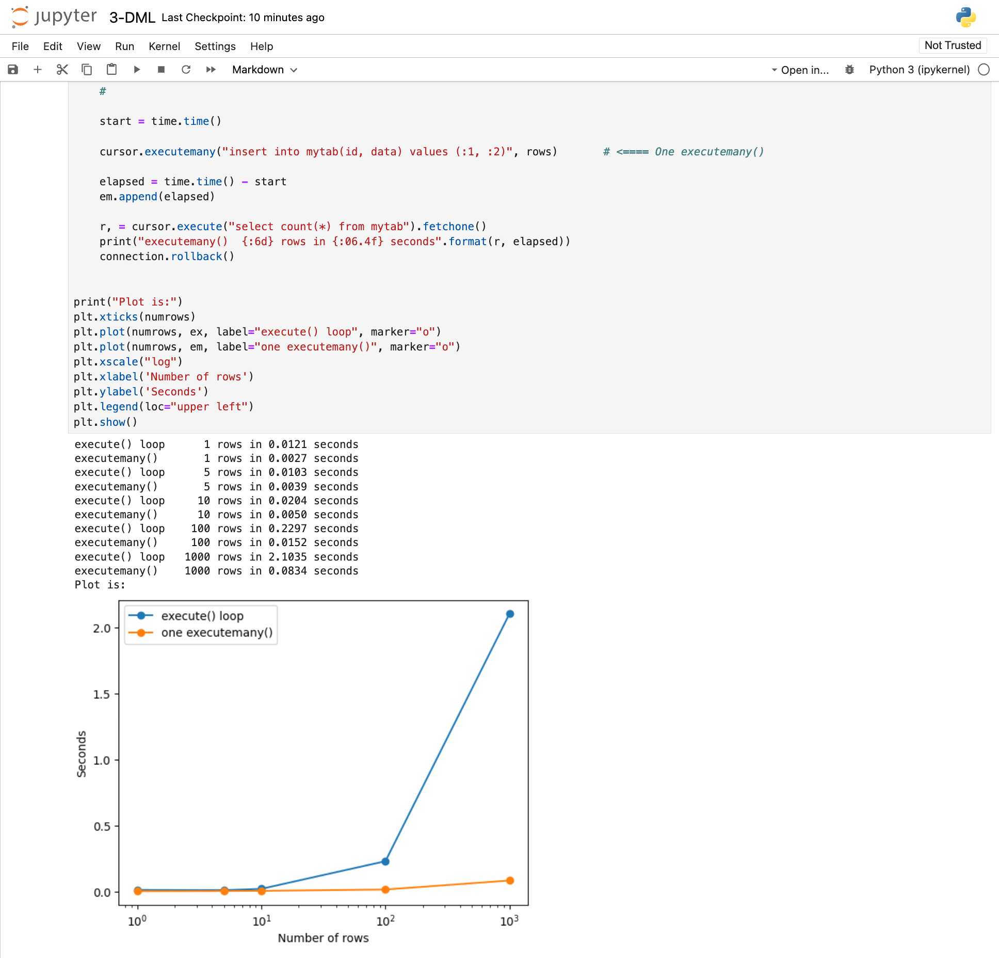

# Python python-oracledb Notebooks

This directory contains Jupyter notebooks showing best practices for using
python-oracledb.  The notebooks cover:

- Connecting
- Queries
- DML
- Data loading and unloading (CSV Files)
- JSON
- PL/SQL
- Objects

Python-oracledb's default 'Thin' mode is used.

Jupyter notebooks let you easily step through, modify, and execute Python code:

# Setup

An existing Oracle Database is required.  The JSON demo assumes that Oracle
Database 21c or later is being used.

### Install Python 3

See https://www.python.org/downloads/

### Install Jupyter

See https://jupyter.org/install:

    python3 -m pip install notebook

### Install the python-oracledb driver

    python3 -m pip install oracledb

### Install some libraries used by the examples

    python3 -m pip install numpy matplotlib

### Create the python-oracledb sample schema

Clone the python-oracledb repository, for example in a terminal window:

    git clone https://github.com/oracle/python-oracledb.git

    cd python-oracledb/samples

Review README.md and sample_env.py

In the terminal, set desired credentials, for example:

    export PYO_SAMPLES_ADMIN_USER=system
    export PYO_SAMPLES_ADMIN_PASSWORD=oracle
    export PYO_SAMPLES_CONNECT_STRING=localhost/orclpdb1
    export PYO_SAMPLES_MAIN_USER=pythondemo
    export PYO_SAMPLES_MAIN_PASSWORD=welcome
    export PYO_SAMPLES_EDITION_USER=pythoneditions
    export PYO_SAMPLES_EDITION_PASSWORD=welcome
    export PYO_SAMPLES_EDITION_NAME=python_e1

Install the schema:

    python3 create_schema.py

### Start Jupyter

    cd notebooks
    jupyter notebook

If Jupyter is not in your path, you may need to find it on your computer and
invoke it with an absolute path, for example on macOS:

    $HOME/Library/Python/3.9/bin/jupyter notebook

Load each notebook *.ipynb file and step through the cells.

Before running the notebooks cells, edit the credentials and connect string
near the top of each notebook to match those used when installing the sample
schema.
