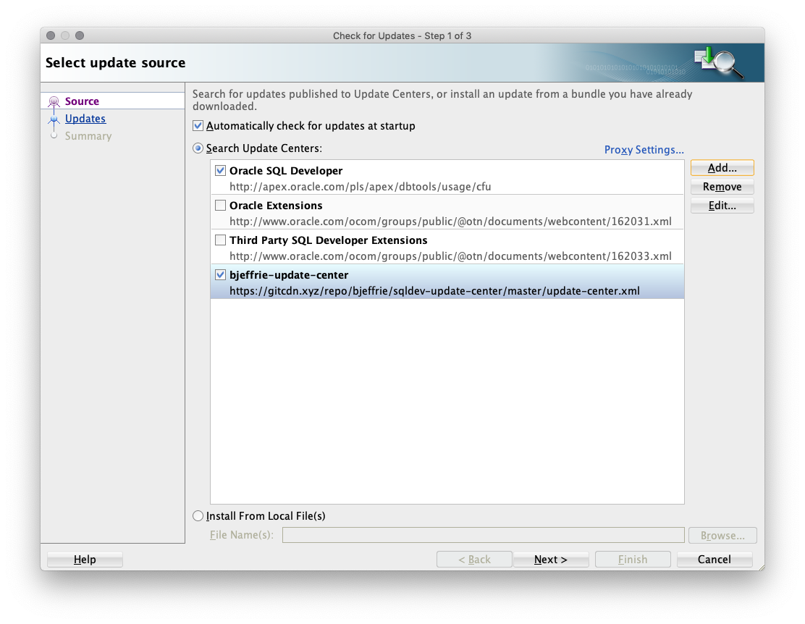
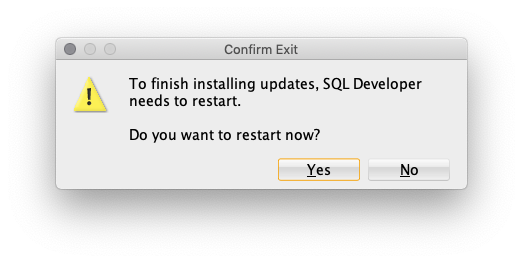

# [SQL Developer](http://www.oracle.com/technetwork/developer-tools/sql-developer/) Examples

## Managing Extensions
  * [Getting Extensions](#getting-extensions)
    * [Download Centers](#download-centers)
      * [Adding an Update Center](#adding-an-update-center)
      * [Using an Update Center](#using-an-update-center)
    * [Using a Check for Updates bundle](#using-a-check-for-updates-bundle)
    * [Build your own](#build-your-own)
  * [Enabling and Disabling Extensions](#enabling-and-disabling-extensions)
  * [Removing or Rolling Back Extensions](#removing-or-rolling-back-extensions)

### Getting Extensions
#### Download Centers
Navigate to Help->Check for Updates.

##### Adding an Update Center
If you need to add a reference to an update center, press the Add button to enter the name and location. If the new update center is web based, enter the URL. If it is file system based, enter the path or use the browse button. There is an external _(not supported by Oracle)_ [example update center](https://github.com/bjeffrie/sqldev-update-center) for these extensions. You can add https://raw.githubusercontent.com/bjeffrie/sqldev-update-center/master/update-center.xml as an update center location to access it.

##### Using an Update Center
Check the update centers you want to search and hit Next. You will be presented with a list of updates available for your version of SQL Developer from the selected update centers. Clicking on an entry shows information about the extension in the right panel. Select the extensions you want to add/update.

Press Next.

Press Finish. If there are any licenses required, you will be asked to accept them. SQL Developer will ask you if it can restart.

#### Using a Check for Updates bundle
A Check for Updates (CFU) bundle is a zip file with the extension and metadata about it. Select Install from Local File(s), and enter the path or use the Browse button. _(The [Example Update Center](https://github.com/bjeffrie/sqldev-update-center) (external) has pre-built cfu bundles for these examples.)_

Press Next.

Press Finish. If there are any licenses required, you will be asked to accept them. SQL Developer will ask you if it can restart.

#### Build your own
See the [Set Up / Tutorial](./setup.md) - A step by step guide to building your first extension and check for updates bundle. See the extension [read me](./README.md) for other example extensions.

### Enabling and Disabling Extensions
__Note:__ _The About Oracle SQL Developer dialog has an Extensions tab that displays the load status. Newly installed extensions are typically in "Triggers Loaded" state which means SQL Developer 'knows' about the extension, but has not "Fully Loaded" it yet. Loading is (generally) triggered by either choosing a menu action provided by the extension or visiting its preference page (if any). Once fully loaded, most extensions will fully load on subsequent sessions._

Navigate to Tools->Features...

If the extension allows it, you can use the check boxes to toggle extensions on and off from this page. There will be a pop-up progress dialog while the extension loading information is updated.

### Removing or Rolling Back Extensions
Navigate to Tools->Features... and select the Installed Updates tab.

From this panel, you can uninstall or roll back updates by selecting the desired entries and pressing Uninstall.
