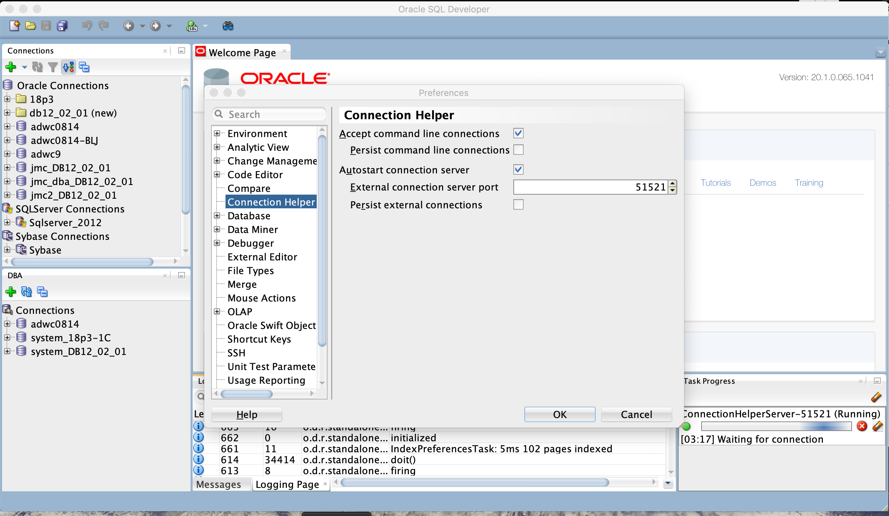

# SQL Developer Examples
## ConnectionHelper
Optionally accept connection info from the command line and/or on a [SocketServer](https://docs.oracle.com/javase/tutorial/networking/sockets/clientServer.html)

### Command Line
sqldeveloper -_conName_**=**_user_\[**/**\[_pw_]]**@**_host_**:**_port_(**:**_sid_|**/**_svc_)\[**#**_role_]

Where:
- *connName* is the name you would like for the connection
- *user* is the user name for the schema you want to use
- */password* is the password for that user *(optional - if missing e.g., user@ or user/@, SQLDeveloper will prompt for it)*
- *host* is the host that the database is on
- *port* is the port the database is listening on
- *:sid* is the sid for the database *(One of :sid or /svc MUST be supplied)*
- */svc* is the service name for the database  *(One of :sid or /svc MUST be supplied)*
- *#role* is the role  *(optional - one of SYSDBA, SYSOPER, SYSBACKUP, SYSDG, SYSKM, SYSASM if used)*

### Overview
[extension.xml](ext/extension.xml) declares [ConnectionHelperPreferencePanel](src/oracle/db/example/sqldeveloper/extension/connectionHelper/ConnectionHelperPreferencePanel.java) as a trigger hook so the extension will be fully loaded once the preference page is opened and [ConnectionHelperAddin](src/oracle/db/example/sqldeveloper/extension/connectionhelper/ConnectionHelperAddin.java) as an Addin whos initialize method will be called on SQLDeveloper start up.

[ConnectionHelper](src/oracle/db/example/sqldeveloper/extension/connectionhelper/ConnectionHelper.java) is where the 'do the work' stuff lives.
1. Creates the requested connection in a "Persistent" or "Transient" folder
2. Navigates to and opens the new connection
3. If transient, sets up a hook to remove the connection when SQLDeveloper shuts down

[ConnectionHelperAddin](src/oracle/db/example/sqldeveloper/extension/connectionhelper/ConnectionHelperAddin.java) adds an IdeListener to process ConnectionHelper options once the main window comes up. *(TODO:? Show non-deprecated technique for doing something after the window finishes loading? See OptInHandler$DialogWaitTask)*

[ConnectionHelperPreferenceModel](src/oracle/db/example/sqldeveloper/extension/connectionhelper/ConnectionHelperPreferenceModel.java) is the data class for managing connection helper preferences and integrating with the core preference storage.

[ConnectionHelperPreferencePanel](src/oracle/db/example/sqldeveloper/extension/connectionHelper/ConnectionHelperPreferencePanel.java) 

* Accept command line connections - Parse SQLDeveloper command line for connection request(s) when checked and on subsequent SQDeveloper start up. *[false]*
* Persist command line connections - Persist connection(s) specified on the command line. Also controls (Persistent/Transient) folder the connection(s) will be placed in. *[false]*
* Autostart connection server - Start the ConnectionHelperServer when checked and on subsequent SQDeveloper start up. *[false]*
* External connection server port - the port to listen for connection requests on. *[51521]*
* Persist external connections - Persist connection(s) received by the ConnectionHelperServer. Also controls (Persistent/Transient) folder the connection(s) will be placed in. *[false]*
* *(TODO:? Replace button actions to start command line/server with property listeners on the preference properties so nothing happens until you OK the preference changes?)* 

[ConnectionHelperServer](src/oracle/db/example/sqldeveloper/extension/connectionHelper/ConnectionHelperServer.java) is a [SocketServer](https://docs.oracle.com/javase/tutorial/networking/sockets/clientServer.html) that listens for connection requests on a specified port *[51521]*

[//]: # (https://github.com/PhilippSalvisberg/sqldev)
