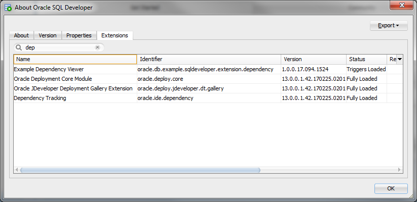
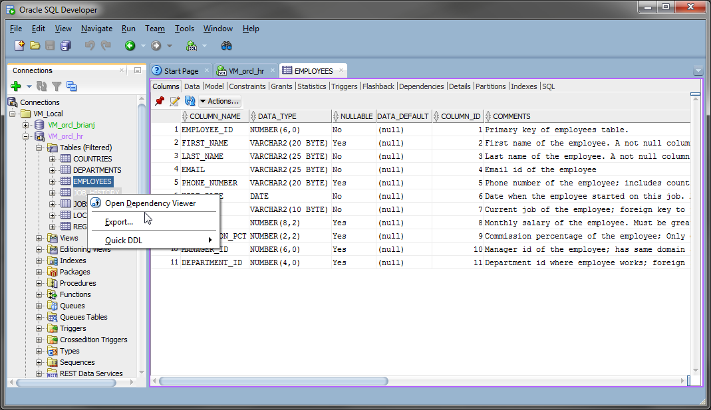
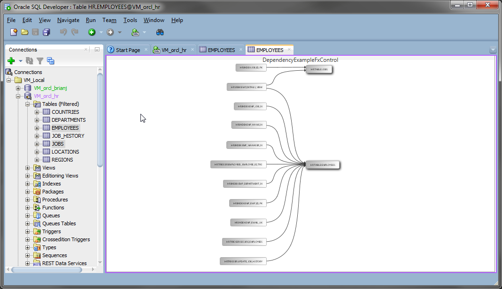
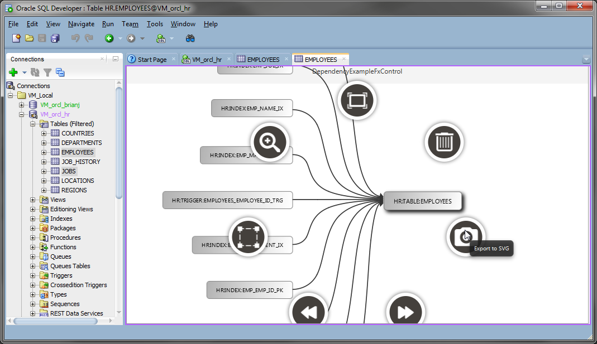

# SQL Developer Examples
## DependencyExample
This example is built with ant but is also set up for editing & (remote) debugging in the eclipse extension project.  
* Building this example requires two external libraries. Copy the required jar files to DependencyExample/lib.  
The exact jars needed from them can be found in *DependencyExample/DependencyExample.userlibraries* which you will also need to import to use eclipse.  
    * [FXDiagram 0.35.0](http://dl.bintray.com/jankoehnlein/FXDiagram/standalone/:fxdiagram-jars-0.35.0.zip "fxdiagram-jars-0.35.0.zip")  
    * [KIELER KLay Layouters 0.14.0](http://rtsys.informatik.uni-kiel.de/~kieler/files/release_pragmatics_2015-02/klay/klay_2015-02.jar "klay_2015-02.jar")

[Set up your environment](../../setup.md), get the required libraries (see above), build the (default) deploy target, and start SQLDeveloper from the command line WITH THE (sqldeveloper/bin/)sqldeveloper -clean OPTION.  

On the first run, only the triggers defined in extension.xml will load.  
  
In our case, that means the context menu entry only and NOT the dependency viewer tab referenced in the hook section (via DependencyExampleGraphViewer.xml which is in the directory the hook says to load xml from)
  
Which opens the dependency diagram AND causes the rest of the extension hooks to load. (The editor tab name is pulled from the 1st selected node but will switch when focus goes to another editor and back. TODO: This really should be implemented as it's own dockable, not as an 'editor'.) 
  
the diagram is scrollable, zoomable, editable, and can be exported to svg (all thanks to the FXDiagram library.) Double clicking on a node performs a "DrillLink" to open the SQL Developer editor for that node.  
  
Now that it is fully loaded, the viewer definition is active and a dependency graph tab is added to the object viewers. (The next time a new one is opened.) 
  
