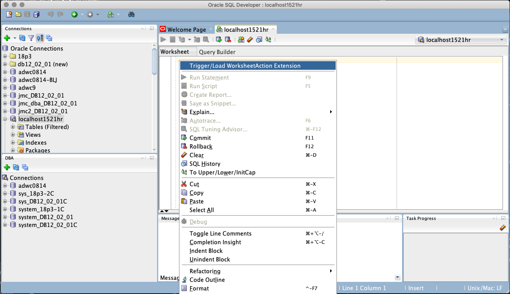
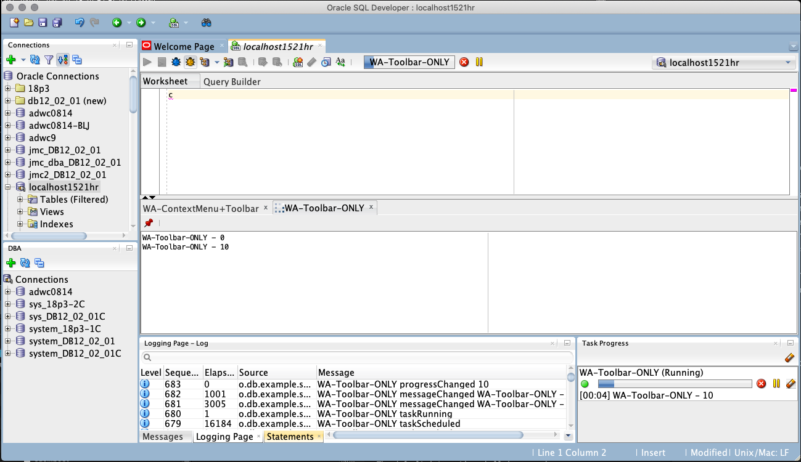

# SQL Developer Examples
## Worksheet Action

Example extension showing how to add actions to the worksheet context menu and / or toolbar; execute the action directly or in a background task; and present information in a result panel. 


### Build it
[Set up your environment](../../setup.md). If using the eclipse project, also modify paths in *SQLDeveloper.userlibraries* and import into eclipse. (This example was built using the "SQLDeveloper 20.1" Library) 
* Build and install using those instructions

### Try it


#### First time (Use the trigger to fully load the extension)
* Open a worksheet
* Select "Trigger/Load WorksheetAction Extension" from the context menu
* Close the worksheet
* Only have to do that the 1st time as extension.xml says to reload once loaded
* Typically this would be part of a larger extension with natural triggers IMHO & not need this hack.



#### Then (Extension loaded, now what?)
* Open a worksheet
* Positioning
* * Toolbar: Has entries for BOTH (blue bug) and TOOLBAR_ONLY (yellow bug)
* * Context menu: Has entries for BOTH (blue bug) and CONTEXT_MENU_ONLY (purple bug)
* Enabling:
* * BOTH - Enabled unless the worksheet connection is disconnected
* * CONTEXT_MENU_ONLY - Always enabled
* * TOOLBAR_ONLY - Enabled only when there is text in the editor
* Running (*Open the task progress viewer* (View->Task Progress) *to see the task messages which do not show on the toolbar task viwer.*)
* * The [ExampleActionTask](src/oracle/db/example/sqldeveloper/extension/worksheetAction/ExampleActionTask.java) sets up a ten second loop to demonstrate setting progress / status as well as checking for cancel/pause
* * Try pause / resume / cancel
* * Try running twice without closing result window - note the 2nd one 'replaces' the original. Try pinning the result & running again - a second result window should be used.
* * try running multiple ones at the same time. You should see them stacked in the task viewer waiting on each other running one at a time.

### Change it
* Read the section on How it works & play.
* * How does it work if one of them has a different "connectionName"? (not blocked from running by others with a different name)
* * How about sending null for callback & id? (no result panel, worksheet not locked when the task runs)
* * How about adding your own listener to do something?
* * . . . 


### How it works
[extension.xml](etc/extension.xml) 
* In the trigger-hooks/triggers section, declares a dummy trigger action (*WorksheetAction.DUMMY*), with [DummyActionController](src/oracle/db/example/sqldeveloper/extension/worksheetAction/DummyActionController.java) as controller, always enabled on the context menu of any editor to load the extension.
* In the hooks/jdeveloper-hook section, declares the actions (*WorksheetAction.BOTH*, *WorksheetAction.CONTEXT_MENU_ONLY*, *WorksheetAction.TOOLBAR_ONLY*) we will be adding with this extension.
* and finally, hooks/sqldev-worksheet-hook declares the [ExampleActionProvider](src/oracle/db/example/sqldeveloper/extension/worksheetAction/ExampleActionProvider.java) that defines the processing for and integrates those actions with the worksheet.

[DummyActionController](src/oracle/db/example/sqldeveloper/extension/worksheetAction/DummyActionController.java)
* As its name implies, this is a controller that does nothing. It and the associated action exist in this extension only to provide a mechanism to demand load the extension in the absence of any natural trigger(s).

[ExampleActionProvider](src/oracle/db/example/sqldeveloper/extension/worksheetAction/ExampleActionProvider.java)
 This is the brains of the outfit, it
* Declares contants for the actions ids (matching the ids declared in extension.xml)
* ```getActionAt``` Creates a worksheet action for each id specifying menu(s), section, and weight for each
* ```doAction``` Executes the processing for each id with the context passed in. In this case, all three use an [ExampleActionTask](src/oracle/db/example/sqldeveloper/extension/worksheetAction/ExampleActionTask.java)
* * NOTE: *If the action is quick* (think e.g., format text) *and isn't something that requires a task in its own right* (e.g., anything that talks to the database), you can do / invokeLater the action here and return null.
* * For tasks, wraps that up for the worksheet along with any listeners and / or viewers desired. For a viewer, we are getting the one from the worksheet context (which is the toolbar task viewer), For listeners, this example adds
* * * ```getTaskListenerList``` - Log task listener events (INFO/SEVERE for exceptions) controlled by LOG_TASK_EVENTS
* * * ```getTaskUIListenerList``` - Log task UI listener events (INFO) controlled by LOG_TASK_UI_EVENTS
* * * (*Uncomment* oracle.level = INFO *in logging.conf to have them show in the log window*)
* ```checkActionEnabled``` is set up with different criteria for each action
* * *WorksheetAction.BOTH* -  return (we have a connection)
* * *WorksheetAction.CONTEXT_MENU_ONLY* - return true (always enabled)
* * *WorksheetAction.TOOLBAR_ONLY* - return (editor has text)

[ExampleActionTask](src/oracle/db/example/sqldeveloper/extension/worksheetAction/ExampleActionTask.java) - a dummy task to show the basic mechanics plus how to attach a result panel to the worksheet. Sets up a ten second loop to demonstrate setting progress / status as well as checking for cancel/pause
* Why DatabaseQueryTask or derivative? 
* * It serializes executions against a string (connectionName). 
* * If you are going to access the worksheet's (or any shared) connection, you MUST use a task to do so. 
* * This can also be used to serialize executions of your actions.
* How to set up a result panel
* How to lock the worksheet while processing
* How to support pause / cancel

[ExampleResultPanel](src/oracle/db/example/sqldeveloper/extension/worksheetAction/ExampleResultPanel.java)- a really simple result panel just allowing text to be appended.


