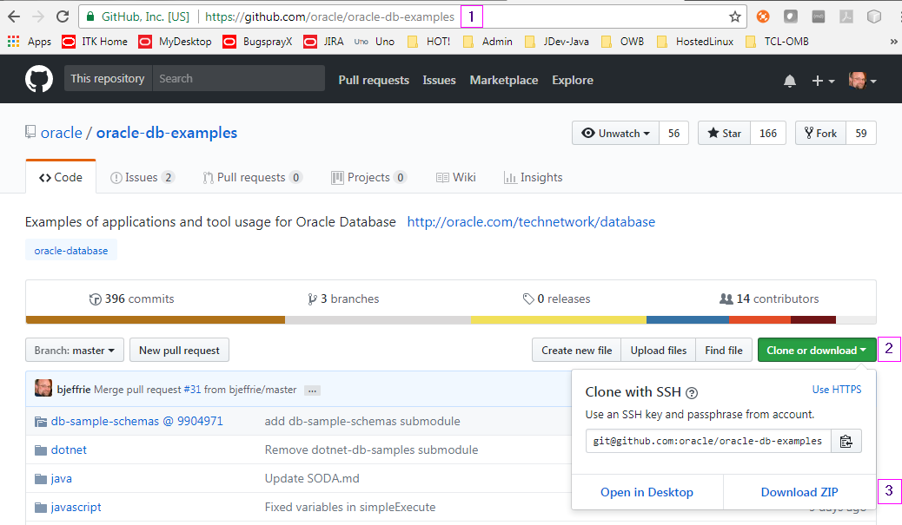
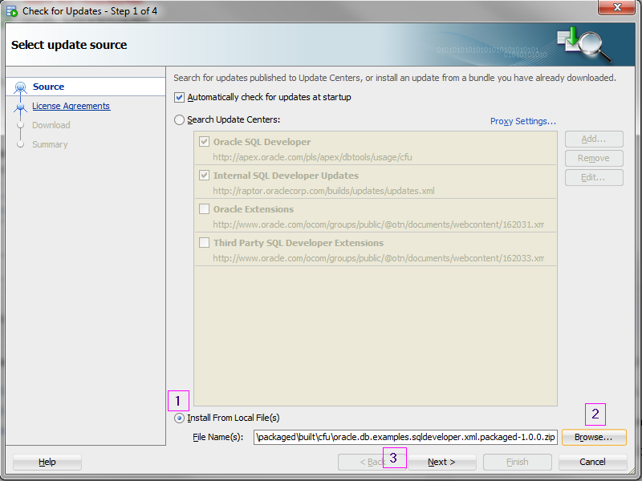

# [SQL Developer](http://www.oracle.com/technetwork/developer-tools/sql-developer/) Examples

## First things first: Getting the pieces

### Java JDK 8
We are currently using [jdk1.8.0_152](http://www.oracle.com/technetwork/java/javase/downloads/java-archive-javase8-2177648.html)

### SQL Developer
You'll need a copy of [SQL Developer](http://www.oracle.com/technetwork/developer-tools/sql-developer/) both as a deployment location for testing and as the source for required library files.

### The Examples
Currently the SQL Developer examples are part of a larger set that must be downloaded together. 

1. Go to the main [oracle-db-examples](https://github.com/oracle/oracle-db-examples) page, 
2. Select the green Clone or download button, 
3. and then the Download ZIP button.
4. unzip the file somewhere (we only really need the sqldeveloper folder)



### Third party libraries
**If** you plan to build the [Dependency Example](https://github.com/oracle/oracle-db-examples/tree/master/sqldeveloper/extension/java/DependencyExample), you will also need:
* [FXDiagram 0.35.0](http://dl.bintray.com/jankoehnlein/FXDiagram/standalone/fxdiagram-jars-0.35.0.zip "fxdiagram-jars-0.35.0.zip")  
* [KIELER KLay Layouters 0.14.0](http://rtsys.informatik.uni-kiel.de/~kieler/files/release_pragmatics_2015-02/klay/klay_2015-02.jar "klay_2015-02.jar")

### The build environment
sqldeveloper/extension is an eclipse project directory but the examples are built using Apache ant. If you don't know or want to use eclipse, you can [download ant](https://ant.apache.org/bindownload.cgi) and do everything simply from the command line.

 
## Wiring it together
### build.properties
* extension/build.properties - Update to point to your SQL Developer installation & optionally change the owner info.

### Third party libraries
**If/when** you plan to build the [Dependency Example](https://github.com/oracle/oracle-db-examples/tree/master/sqldeveloper/extension/java/DependencyExample), see that page for additional set up requirements.

## Making it go
If you are using eclipse, I'm going to assume you know how to import an existing project and run ant tasks but continue reading to learn about the various ant tasks and how they are used.

If you are using ant from the command line, make sure `ANT_HOME` and `JAVA_HOME` are defined for your environment and that ant is on your `PATH` and accessible from the command line.

### Ant tasks
The [XML Packaged](xml/packaged) example and all of the [Java](java) examples use ant to build and deploy the example. The 'heavy lifting' is all defined in buildtools so the individual build.xml files for each example are pretty simple. There only a few targets of interest:
* `_rebuild` cleans and deploys the example
* `_deploy` builds and deploys the example to the target SQL Developer installation (defined in build.properties). Please remember to exit out of SQL developer before running this so you don't confuse yourself. (Which I have great experience with :/ )
* `_cfu` creates a check for updates bundle and associated metadata xml file in the built/cfu directory for the example. 
* `resgen` generates the ResourceBundle java files from the .properties files listed in resfiles.properties. Running this manually - and then refreshing the project - is only "needed" if you are using eclipse and want code completion and the error checker to know about new entries when editing java.

### _deploy Example
```
cd <where you put examples>/sqldeveloper/extension/xml/packaged
ant _deploy
cd <where you put sqldeveloper>/sqldeveloper/bin
sqldeveloper -clean
```

### cfu example
```
cd <where you put examples>/sqldeveloper/extension/xml/packaged
ant _cfu
cd <where you put sqldeveloper>/sqldeveloper/bin
sqldeveloper
```
Navigate to Help->Check for Updates
1. Select Install From Local File(s)
2. Browse to <where you put examples>/sqldeveloper/extension/xml/packaged/built/cfu and select the zip file
3. Select Next, then Finish on the next page
4. Accept SQL developer restart




