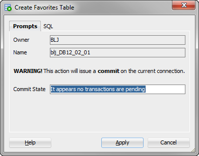
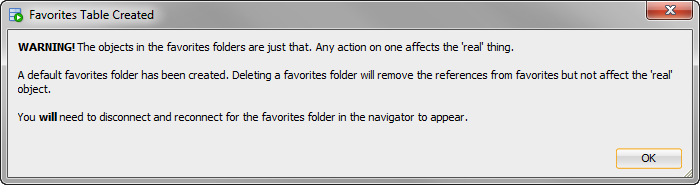
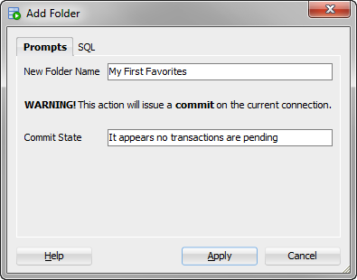
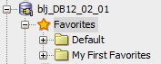
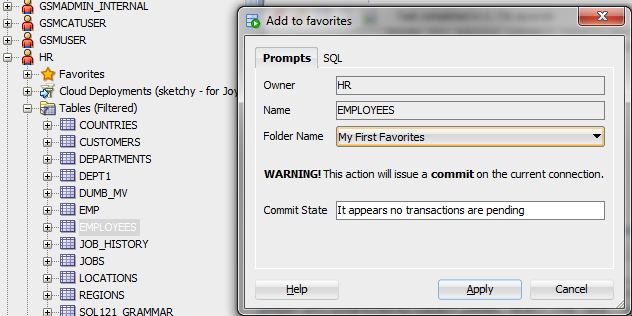
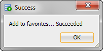
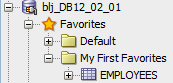
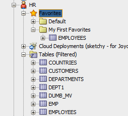

# [SQL Developer](http://www.oracle.com/technetwork/developer-tools/sql-developer/) Examples
## Simple Favorites
XML-Based favorites folders (packaged as an extension.jar)

This extension ands the ability to manage and use a simple favorites table in the connection schema (or available via public synonym from another). 

### First, The Ugly

* Because of the simplistic design, creating the table and adding favorites will require issuing a commit on the current connection. All actions state this explicitly and indicate if there are transactions pending.

* In order for the objects in a favorites folder to behave as the real thing, a separate query must be used for each object type. This example includes all 50+ of the types shown in an Oracle connection navigator. I encourage you to remove the types you do not care about from favorites_nav.xml & favorites_actions.xml if the performance is an issue.

* Since the objects in a favorites folder act as the real object, you can delete a favorites folder via context menu from the tree but will need to use SQL or the data viewer on the raw SQX$FAVORITES table to remove favorites from a folder.

* Since the focus is on the object you are adding to favorites, the favorites tree will not update automatically. You will need to manually update the favorites / folder node to see the newly added object references. 

### Now The Good

* It's pretty darn useful even with the limitations!

* After installing the extension or using one of the [manual methods](../../xml) to register the raw XML files, use the context menu on an open connection to create the favorites table.  
 

* The context menu on Favorites allows you to add folders or drop the favorites table.  
 

* The context menu on any object declared in favorites_actions.xml will have an add to favorites option. Choosing a favorites folder to put it in is required.  
  

* Note that since favorites is declared for connType="Oracle", it will "follow you"  as you navigate to / add to favorites from the Other Users tree nodes.  
 

### And Lastly
Given the interest this has generated, I am looking at doing a java working sets style version to overcome the ugly aspects of this one. Perhaps as a hands on lab or OBE kind of series. 

I welcome feedback on this example and ideas for desirable features of a potential working sets version at [my fork](https://github.com/bjeffrie/oracle-db-examples) of the examples repository.

#### The changes I see needing are:
* Separate navigator / connection / repository for working sets. (I.e., similar to migrations or unit testing so the current connection is not impacted.)
* Much more efficient declaration and handling of favorites folder contents and actions.
* Being able to manipulate favorites references from the tree (delete specifically but maybe also drag / drop operations)
* Updating the favorites hierarchy when adding new references.
* Favorites folder nesting? Unlimited or?

 