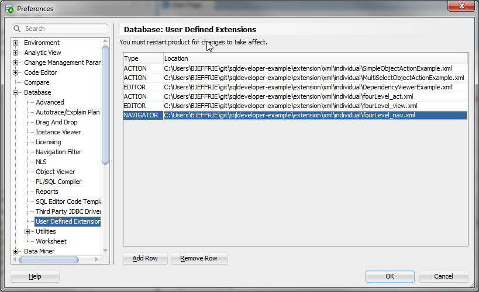
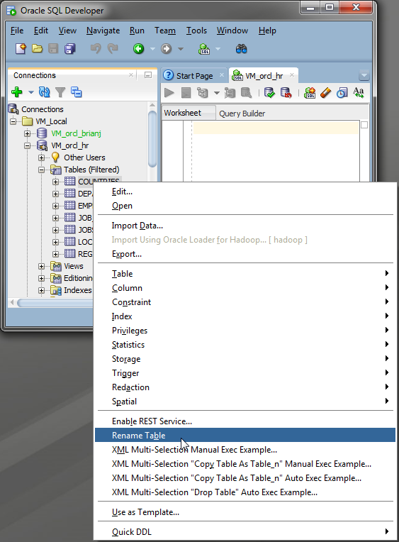
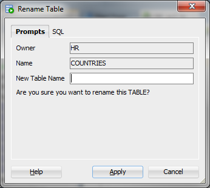
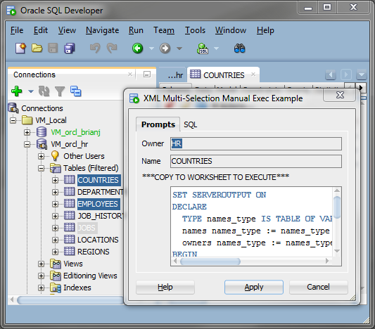
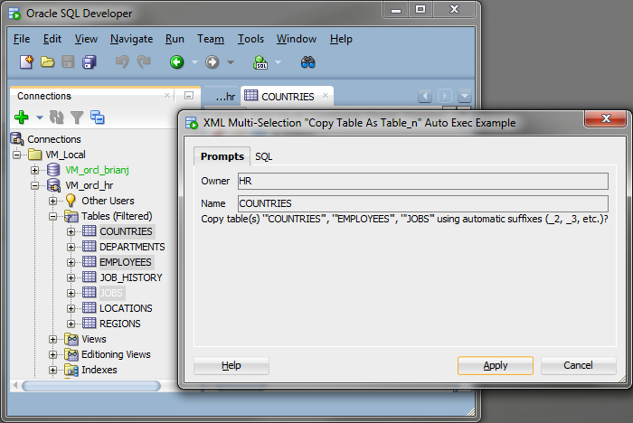
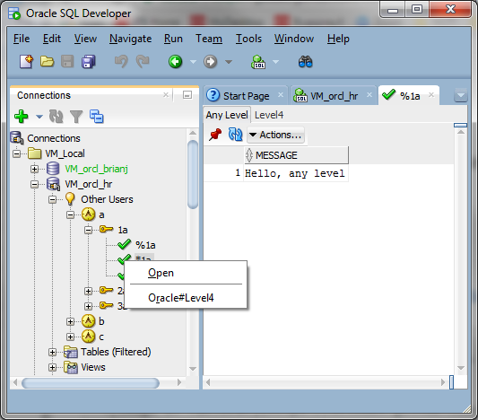

# [SQL Developer](http://www.oracle.com/technetwork/developer-tools/sql-developer/) Examples
## XML Individual

To see these in action in your own copy of SQL Developer, go to Tools > Preferences > Database > User Defined Extensions and  add them to the list as shown.    
* **SimpleObjectActionExample** *ACTION* - Basic example showing TABLE rename action.  
   
* **MultiSelectObjectExample** *ACTION* - Example showing how to create actions that work on a set objects. There are two examples of each. One that provides a script for you to copy to the worksheet to run, and another that actually executes it.  
   
* **fourLevel** *ACTION,EDITOR,NAVIGATOR* - Consolidated example showing how all three types are wired together.
  
