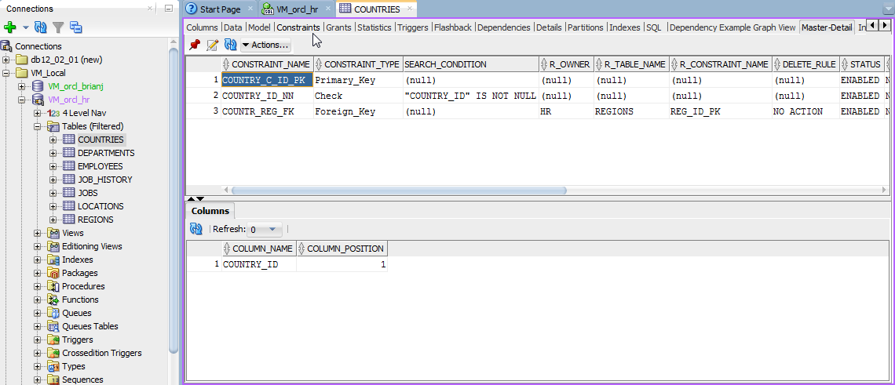
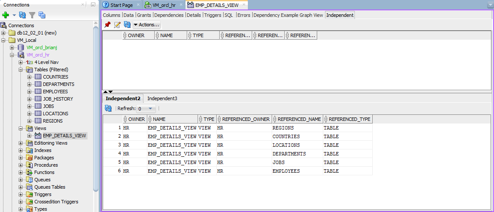
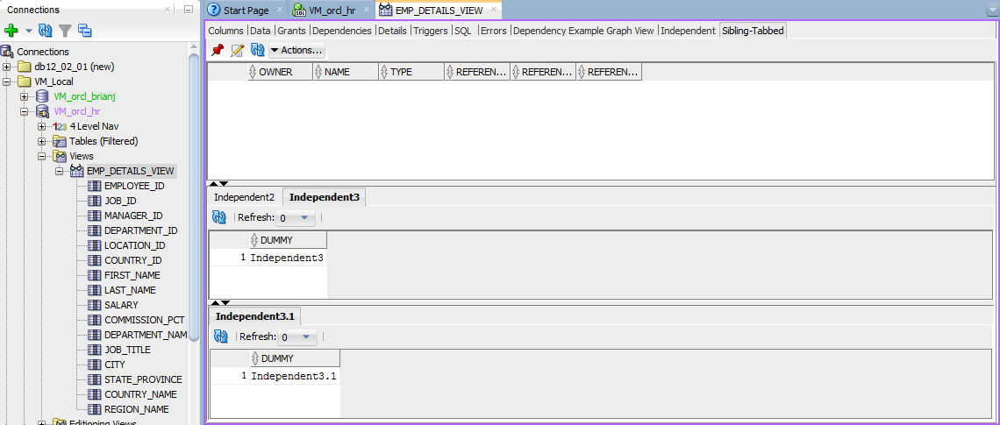

# [SQL Developer](http://www.oracle.com/technetwork/developer-tools/sql-developer/) Examples
## XML Individual

To see these in action in your own copy of SQL Developer, go to Tools > Preferences > Database > User Defined Extensions and  add them to the list as shown.    
  
  
* **SimpleObjectActionExample** *ACTION* - Basic example showing TABLE rename action.  
   
  
  
* **MultiSelectObjectExample** *ACTION* - Example showing how to create actions that work on a set of objects. There are two examples of each. One that provides a script for you to copy to the worksheet to run, and another that actually executes it.  
   
  
  
* **fourLevel** *ACTION,EDITOR,NAVIGATOR* - Consolidated example showing how all three types are wired together.  
  

  
* **NestedDisplaysExample** *EDITOR* - Example showing how to create parent-child (master-detail), independent (top-bottom), and sibling-tabbed displays.  
    * *Master-Detail* - A simplified version of the Constraints display for TABLE.  

    * *Independent* -  A simplified version of the Dependencies display for TABLE,VIEW.  

    * *Sibling-Tabbed* - A simplified version of the Dependencies display for TABLE,VIEW with modifications to show how displays at the same nesting level appear in tabs.  
  
 
 