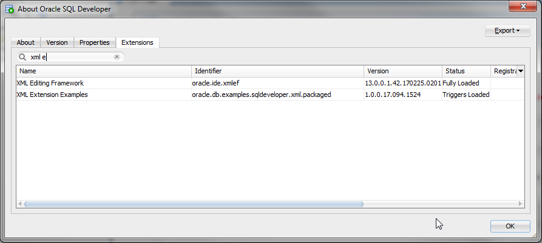
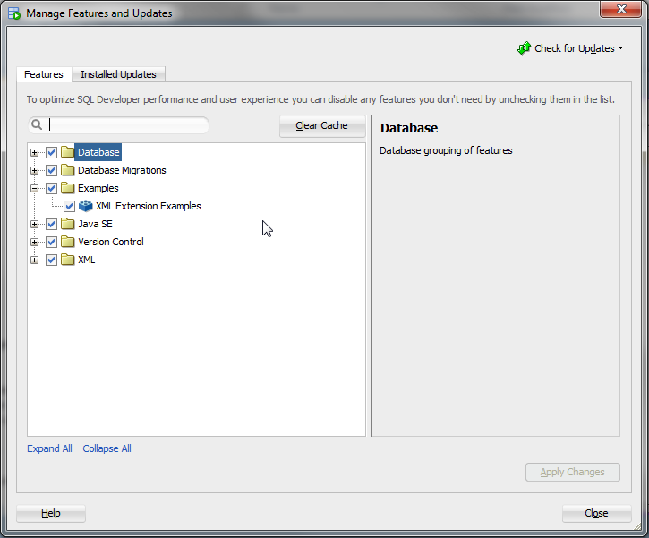
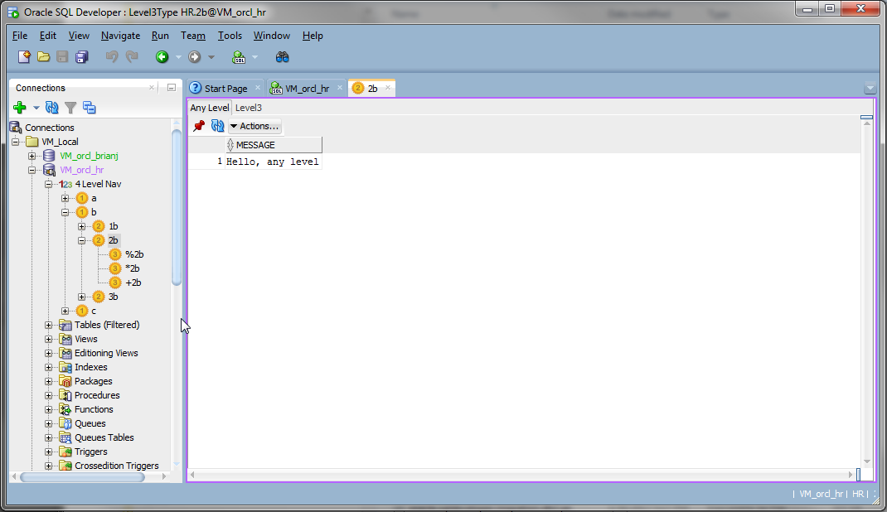

# [SQL Developer](http://www.oracle.com/technetwork/developer-tools/sql-developer/) Examples
## XML Packaged

The fourlevel example from the individual section packed as a jar extension with a real resource file so we can use our own name(s) and icon(s).

[Set up your environment](../../setup.md), build the (default) deploy target, and start SQLDeveloper from the command line WITH THE (sqldeveloper/bin/)sqldeveloper -clean OPTION.

The etc/extension.xml declares how the extension plugs in to SQL Developer. 

Since our navigator is defined for an Oracle connection, the extension will trigger when an Oracle connection is opened.  
  
The feature-category element we added in extension.xml puts our example in tools > features. Note that the name & description are coming from the ExampleResources.properties file. These are designed so that you can add ResourcesProperties_*<locale>*.properties for other languages. (e.g. ResourcesProperties_fr.properties for French.)  
  
and similarly for the text and icons displayed in the navigator.  
  
